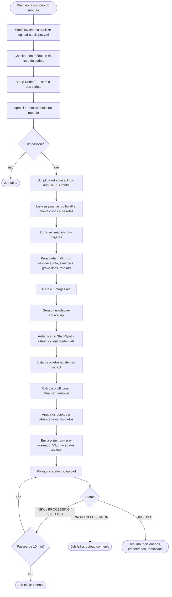
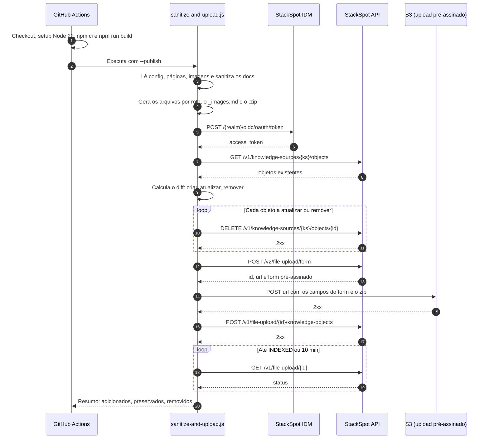

# docs-workflows

Workflow reutilizável do GitHub Actions que pega a documentação de um site **Docusaurus**, sanitiza os
arquivos `.md`/`.mdx`, nomeia cada um pela rota final da página e envia tudo, em um `.zip`, para uma
**Knowledge Source (KS)** do StackSpot AI.

> **Estado atual:** o workflow roda com um **mock** do StackSpot (`use-mock: true`, que é o padrão), e a etapa de
> sanitização ainda é um stub (devolve o conteúdo sem alterar). Veja [Estado atual e pendências](#estado-atual-e-pendências).

## Sumário

- [Como usar](#como-usar)
- [Parâmetros](#parâmetros)
- [Secrets](#secrets)
- [Requisitos do módulo que chama](#requisitos-do-módulo-que-chama)
- [Etapas da action](#etapas-da-action)
- [O que o script faz](#o-que-o-script-faz)
- [Diagramas do fluxo](#diagramas-do-fluxo)
- [Reconciliação com a Knowledge Source](#reconciliação-com-a-knowledge-source)
- [Arquivos gerados](#arquivos-gerados)
- [Rodar localmente](#rodar-localmente)
- [Mock do StackSpot](#mock-do-stackspot)
- [Estado atual e pendências](#estado-atual-e-pendências)
- [Estrutura do repositório](#estrutura-do-repositório)

## Como usar

No repositório do módulo (o que tem o Docusaurus), crie um workflow que chama este:

```yaml
name: Deploy Docs

on:
  push:
    branches: [main]

jobs:
  call-sanitize-upload:
    uses: rafaelcrz/docs-workflows/.github/workflows/sanitize-upload-stackspot.yml@v1
    with:
      ks-slug: 'nome-da-knowledge-source'
      # docs-path: 'docs'          # opcional
      # use-mock: false            # opcional (padrão: true)
      # stackspot-realm: 'meu-realm'
    secrets:
      STACKSPOT_CLIENT_ID: ${{ secrets.STACKSPOT_CLIENT_ID }}
      STACKSPOT_CLIENT_SECRET: ${{ secrets.STACKSPOT_CLIENT_SECRET }}
      DOCS_WORKFLOWS_TOKEN: ${{ secrets.DOCS_WORKFLOWS_TOKEN }}
```

O `@v1` é uma tag deste repositório. Mudanças feitas aqui só chegam aos módulos depois que a tag `v1` for
movida ou recriada.

## Parâmetros

Inputs do `workflow_call` (bloco `with:`):

| Input | Obrigatório | Padrão | Descrição |
|---|---|---|---|
| `ks-slug` | sim | — | Slug da Knowledge Source de destino. Vira a variável `KS_SLUG` do script. |
| `docs-path` | não | `docs` | Pasta com os `.md`/`.mdx`, relativa à raiz do módulo. |
| `use-mock` | não | `true` | `true`: sobe o mock local e envia para ele. `false`: fala com o StackSpot real. |
| `stackspot-realm` | não | `''` | Realm do StackSpot. Com `use-mock: true` o padrão passa a ser `mock`. Com o StackSpot real, é obrigatório. |

## Secrets

| Secret | Obrigatório | Para que serve |
|---|---|---|
| `STACKSPOT_CLIENT_ID` | sim | Client ID da credencial do StackSpot. |
| `STACKSPOT_CLIENT_SECRET` | sim | Client secret da credencial. A credencial precisa das permissões `ai_dev` e `ai_admin`. |
| `DOCS_WORKFLOWS_TOKEN` | sim | Token usado no checkout deste repositório (`docs-workflows`), que fornece os scripts. |

## Requisitos do módulo que chama

- Um `docusaurus.config.js`, `.mjs`, `.cjs` ou `.ts` **na raiz**, um nível acima da pasta de docs. O script lê
  `url` e `baseUrl` desse arquivo para montar as URLs das imagens. A leitura de `.ts` precisa do Node 22.18 ou mais
  novo (o workflow usa Node 22).
- Um `package.json` com o script `build` e um `package-lock.json`, porque o workflow roda `npm ci` e `npm run build`.
- O build do Docusaurus precisa passar. Link quebrado, por exemplo, derruba o job.
- As rotas dos docs são resolvidas com o prefixo `/docs` (valor fixo no script).

## Etapas da action

O job `sanitize-and-upload` roda em `ubuntu-latest`:

| # | Step | O que faz |
|---|---|---|
| 1 | Checkout do módulo (docs) | Clona o repositório que chamou o workflow em `module-docs/`. |
| 2 | Checkout do repo de scripts | Clona `rafaelcrz/docs-workflows` em `scripts-repo/`, usando `DOCS_WORKFLOWS_TOKEN`. |
| 3 | `setup-node` | Instala o Node 22. |
| 4 | Instalar dependências | `npm ci` em `scripts-repo/`. |
| 5 | Build do Docusaurus | `npm ci` e `npm run build` em `module-docs/`, gerando `module-docs/build/`. |
| 6 | Subir mock do StackSpot | Só com `use-mock: true`. Inicia o mock na porta 4010 e espera ele responder. |
| 7 | Sanitizar e enviar ao StackSpot | Roda `scripts/sanitize-and-upload.js` com `--publish`. Em modo mock, aponta as URLs para `localhost:4010`. |
| 8 | Log do mock do StackSpot | Só com `use-mock: true`. Imprime o log do mock, mesmo se o job falhar. |

## O que o script faz

[scripts/sanitize-and-upload.js](scripts/sanitize-and-upload.js) mostra o progresso com etapas numeradas. São 5
etapas, ou 8 com `--publish`:

| Etapa | O que acontece |
|---|---|
| 1. ⚙️ Configuração | Lê `url` e `baseUrl` do `docusaurus.config.*`. |
| 2. 🗂️ Páginas | Lista as páginas geradas em `build/` (cada `index.html` é uma rota). |
| 3. 🖼️ Imagens | Lê o HTML de cada página e extrai as imagens (``) cujo `src` começa com o `baseUrl`. |
| 4. 🧹 Sanitização | Para cada `.md`/`.mdx`, resolve a rota, chama `sanitize()` e grava o arquivo de saída com o nome da rota. |
| 5. 📦 Zip | Gera o `.zip` só com os arquivos criados nesta execução. |
| 6. 🔍 Comparação | (`--publish`) Autentica, lista os objetos da KS e calcula o que criar, atualizar e remover. |
| 7. 🗑️ Remoção | (`--publish`) Apaga os objetos que serão atualizados e os obsoletos. |
| 8. ☁️ Envio | (`--publish`) Envia o zip, cria os knowledge objects e espera a indexação. |

Parâmetros da linha de comando:

| Flag | Padrão | Descrição |
|---|---|---|
| `--path` | — (obrigatório) | Pasta com os `.md`/`.mdx` de origem. |
| `--build-path` | — (obrigatório) | Pasta gerada por `npm run build`. |
| `--output-path` | `./output` | Pasta onde os arquivos renomeados são gravados. |
| `--zip-path` | `./knowledge-source.zip` | Caminho do zip gerado. |
| `--publish` | desligado | Envia o zip ao StackSpot. Sem a flag, o script só gera os arquivos e o zip. |
| `--ks-slug` | env `KS_SLUG` | Slug da KS (só com `--publish`). |

Variáveis de ambiente usadas com `--publish`:

| Variável | Descrição |
|---|---|
| `KS_SLUG` | Slug da KS, quando `--ks-slug` não é passado. |
| `STACKSPOT_REALM` | Realm do StackSpot. |
| `STACKSPOT_CLIENT_ID` / `STACKSPOT_CLIENT_SECRET` | Credenciais OAuth2 (client credentials). |
| `STACKSPOT_IDM_URL` / `STACKSPOT_API_URL` | Trocam as URLs do StackSpot (usado para apontar ao mock). |
| `STACKSPOT_POLL_INTERVAL_MS` | Intervalo do polling de status. Padrão: 2 minutos. O tempo total máximo é 10 minutos. |

## Diagramas do fluxo

Os diagramas abaixo consideram o **StackSpot real** (`use-mock: false`), sem o mock.

### Fluxograma



### Diagrama de sequência



## Reconciliação com a Knowledge Source

Com `--publish`, o script compara o **estado desejado** (os arquivos gerados nesta execução) com o **estado atual**
(os objetos que já existem na KS), usando o nome do arquivo como chave:

| Situação | Operação |
|---|---|
| Existe no build, não existe na KS | **Criar**: vai no zip. |
| Existe nos dois | **Atualizar**: apaga o objeto antigo e envia o novo no zip. |
| Existe na KS, não existe no build | **Remover**: apaga o objeto (página removida do repositório). |

Pontos importantes:

- **Atualizar sempre apaga e reenvia.** Não há comparação de conteúdo, então toda página existente é atualizada a
  cada execução.
- **A KS deve ser gerenciada só por esta action.** Qualquer objeto da KS que não esteja no build é apagado, inclusive
  os criados à mão. A listagem da API não indica quais objetos são manuais ("standalone").
- O `_images.md` entra na reconciliação como qualquer outra página.

## Arquivos gerados

Cada página vira um arquivo `.md` cujo nome é a rota, trocando cada `/` por `_`. O `-` do nome é mantido:

| Rota | Arquivo |
|---|---|
| `/docs/intro` | `docs_intro.md` |
| `/docs/tutorial-basics/create-a-page` | `docs_tutorial-basics_create-a-page.md` |
| `/` | `index.md` |

Os arquivos ficam soltos na pasta de saída, sem subpastas. Se duas rotas diferentes gerarem o mesmo nome (por
exemplo `/docs/a_b` e `/docs/a/b`), o segundo arquivo sobrescreve o primeiro.

Além das páginas, é gerado o **`_images.md`**, com as imagens encontradas agrupadas por página, sem repetição:

```markdown
# Imagens encontradas

## /docs/intro

- https://meu-site.exemplo.com/img/logo.svg
```

Ele é gravado na mesma pasta e vai no mesmo zip das páginas. Sem imagens, o arquivo diz "Nenhuma imagem encontrada.".

## Rodar localmente

Requer Node 22 ou mais novo.

```bash
npm ci

# 1. gere o build no módulo (npm run build) e depois:
node scripts/sanitize-and-upload.js \
  --path /caminho/do/modulo/docs \
  --build-path /caminho/do/modulo/build \
  --output-path ./output
```

Sem `--publish`, nada é enviado: o script só gera os arquivos e o zip. Para testar o envio, use o
[mock](#mock-do-stackspot).

## Mock do StackSpot

A pasta [mock-server/](mock-server/) tem um servidor sem dependências que simula os endpoints do StackSpot usados
pelo script (token, upload, criação de objetos, status, listagem e exclusão). Detalhes e variáveis de controle estão
em [mock-server/README.md](mock-server/README.md).

```bash
npm run mock    # sobe em http://localhost:4010

STACKSPOT_IDM_URL=http://localhost:4010 \
STACKSPOT_API_URL=http://localhost:4010 \
STACKSPOT_POLL_INTERVAL_MS=500 \
STACKSPOT_REALM=mock STACKSPOT_CLIENT_ID=id STACKSPOT_CLIENT_SECRET=secret \
KS_SLUG=minha-ks \
node scripts/sanitize-and-upload.js --path <docs> --build-path <build> --publish
```

No workflow, o mock sobe sozinho quando `use-mock` é `true`. O mesmo README tem a seção **"Como remover os
mocks"**, com o passo a passo para passar a falar com o StackSpot real.

## Estado atual e pendências

- **Sanitização é um stub:** `sanitize()` em [scripts/sanitize.js](scripts/sanitize.js) devolve o conteúdo original.
  A limpeza real (imports MDX, componentes JSX, front matter etc.) ainda não existe.
- **Mock ligado por padrão:** com `use-mock: true`, nada chega ao StackSpot de verdade.
- **Não validado contra o StackSpot real:** o formato da resposta de `GET .../objects` e o nome que o StackSpot dá
  aos objetos vindos de um zip não estão na documentação. A normalização está isolada em `listKnowledgeObjects`
  ([scripts/stackspot-client.js](scripts/stackspot-client.js)). Rode a primeira vez contra uma KS de teste.
- **Paginação:** a listagem de objetos não trata paginação.
- **Criação da KS:** `createKnowledgeSource` existe no cliente, mas não é chamado. A KS precisa existir antes.
- **Split:** os objetos são criados com `split_strategy: NONE` (uma página, um objeto).

## Estrutura do repositório

```
.github/workflows/
  sanitize-upload-stackspot.yml   workflow reutilizável
scripts/
  sanitize-and-upload.js          orquestração e logs
  read-docs-files.js              lista os .md/.mdx de origem
  read-docusaurus-output.js       config, páginas, rotas e imagens do build
  sanitize.js                     sanitização (stub)
  upload.js                       grava o arquivo com o nome da rota
  images-markdown.js              gera o _images.md
  zip.js                          gera o .zip
  reconcile.js                    diff entre build e Knowledge Source
  stackspot-client.js             cliente da API do StackSpot
mock-server/                      mock dos endpoints do StackSpot
```

Documentação do StackSpot usada como referência:
<https://ai.stackspot.com/docs/knowledge-source/create-update-via-api>
